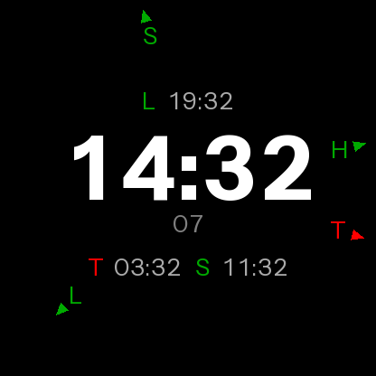

# Zones

A Garmin Connect IQ watch face for telling the time in several places at once.



* The local time, large, in the middle.
* Up to three alternate timezones in sub-displays above and below it, each
  labelled with a single character.
* The seconds under the time, shown only while the display is awake — never in
  always-on mode.
* Every zone, the watch's own included, marked around the bezel at its own
  reading on a 12 hour dial: a pointer arrow at the rim and the zone's letter
  just inside it, **green while the sun is up there** and **red while it is
  down**.

Two zones showing near enough the same time land on the same spot on the dial,
which is the truth — the arrows stay put and the letters step inwards so both
stay readable.

## Building

Needs the [Connect IQ SDK](https://developer.garmin.com/connect-iq/sdk/).

```sh
monkeyc -f monkey.jungle -o bin/zones.prg -y developer_key.der -d fenix7
```

51 round devices are supported, from 260×260 MIP watches up to 454×454 AMOLED.
Each build carries only the bitmap fonts baked for its own screen size.

## Settings

Configured from Garmin Connect on the phone.

| Setting | Meaning |
| --- | --- |
| Watch timezone letter | Labels the watch's own marker on the bezel. |
| Zone *n* letter | One character. **Empty hides the zone.** |
| Zone *n* UTC offset | Hours east of UTC: `-5` for New York, `5.5` for Delhi. |
| Zone *n* position | `latitude,longitude`, e.g. `51.5,-0.13`. |

The position is only used to work out whether the sun is up, and can be left
empty — the zone then treats 06:00–18:00 as daylight. Everything else works
without it.

**Offsets do not follow daylight saving.** Connect IQ has no timezone database,
so an alternate zone is a fixed offset and needs changing twice a year: Berlin
is `1` in winter and `2` in summer. The watch's own time is unaffected — it
comes from the device, which does handle DST.

## Battery

A watch face is redrawn once a second while you are looking at it and once a
minute the rest of the time, so the cost is in what each redraw does.

* **No `onPartialUpdate`.** Seconds are only wanted while the display is awake,
  so there is nothing to draw between minutes and the always-on path is left
  alone entirely.
* **Everything that can only change once a minute is cached** — the time
  strings, every text position, the bezel geometry. A frame in the once-a-second
  path is nothing but `setColor` and `drawText`.
* **Sunrise and sunset are computed once per zone per day**, not per frame, and
  from a closed-form solar equation rather than a network or GPS lookup.
* **No permissions and no sensors.** The face reads the clock and its own
  settings, nothing else.
* **Nothing allocates while drawing.** Per-zone scratch space is allocated when
  the zone list changes.
* **Two fonts, narrow character sets.** Digits, a colon and A–Z, sized so only
  one set per screen size ships.
* On always-on displays the palette dims and the whole face shifts a couple of
  pixels each minute, to spare the panel.

## The typeface

The face is designed for [Innovator
Grotesk](https://yeptype.com/fonts/innovator-grotesk) (Yep! Type Foundry). It is
a commercial typeface, so it is **not** bundled here — the fonts checked in are
built from [Instrument Sans](https://github.com/Instrument/instrument-sans)
(SIL Open Font License, see `tools/fallback-font/`) so that the project builds
as it stands.

With a licence in hand:

```sh
python3 tools/make_fonts.py \
    --font ~/fonts/InnovatorGrotesk-Regular.ttf \
    --time-font ~/fonts/InnovatorGrotesk-Bold.ttf
```

For the variable font, name the instance you want with `--variation Medium`
(and `--time-variation Bold`).

Connect IQ cannot use TTF or OTF directly; fonts have to be baked into
[BMFont](https://www.angelcode.com/products/bmfont/) bitmaps, which is what this
does. It picks the largest glyphs whose longest string still fits inside the
round display, so a wider or narrower typeface than Instrument Sans re-sizes to
fit rather than overflowing. It prints what it chose:

```
416 time  cap=73px line=73px  '88:88'=282px (fits 284px)  sheet=549x73
416 zone  cap=20px line=20px  'W 88:88'=108px (fits 110px)  sheet=594x19
```

## Checks

There is no Connect IQ simulator in every environment, and the compiler cannot
see any of this, so:

```sh
python3 tools/check.py       # resources, fonts, device list, layout, solar
python3 tools/preview.py --size 416 --out preview.png
```

`tools/preview.py` parses the same `.fnt` resources the watch loads and draws
the same geometry, so a layout change can be eyeballed without a device.
`tools/check.py` verifies that the layout constants in `ZonesView.mc`,
`preview.py` and `make_fonts.py` still agree, that every glyph in a `.fnt` is
inside its page and listed in its filter, that every product in the manifest has
fonts for its screen size, and that `Solar.mc` reproduces published sunrise and
sunset times.

## Layout

`source/ZonesView.mc` places everything as a fraction of the screen, so the same
numbers work on every size:

```
                 pointer arrows + letters around the rim
                          L 19:32          0.270
                          14:32            0.448
                            07             0.598   (awake only)
                    T 03:32   S 11:32      0.712
```

`tools/make_fonts.py` sizes the glyphs against those same fractions, which is
why the two have to stay in step and why `tools/check.py` checks that they do.
